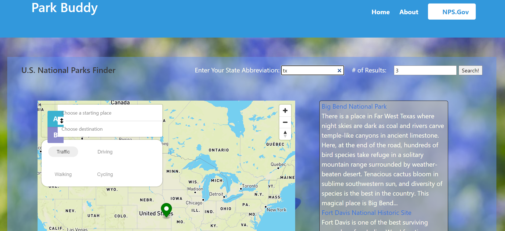

<!-- PARK BUDDY -->

# Park Finder:
Park Buddy 

## Description:

This collaborated project application is meant to be used as a service for those looking to find the nearest national park in their state as well as the most convenient means of getting there.

## User Story:

```

AS A person or a person who has a loved one,
I WANT find the nearest state or national parks in my area

AS A person who wants to visit a national park,
I WANT find the nearest national parks in my area

SO THAT me or my loved one can make memories in a safe and fully interactive environment.
```

## Criteria:

```
GIVEN I am using a location based park finding application
WHEN I open the park finder,
THEN I am shown a brief description of the app as well as an input field that accepts a state and number of search results.
WHEN I enter my state and number of search results.
THEN I am shown an ordered list of locations for national parks in my state with the amount of search results desired.
WHEN I select a location,
THEN the national parks service website is opened.
WHEN I input into starting location and destination on the map,
THEN I am presented with directions.
```
The following image/animation demonstrates the application functionality:



## Application-Links:
- GitHub Repo Link: https://github.com/kjmckinley/park-finder
- Deployed Link: https://kjmckinley.github.io/park-finder/

## Resource-Citations:
## Contributors:
- McKinley, Kyle: https://github.com/kjmckinley
- Ortiz, Richard: https://github.com/xRitchie91
- Harbison, Noah: https://github.com/nizzyno
